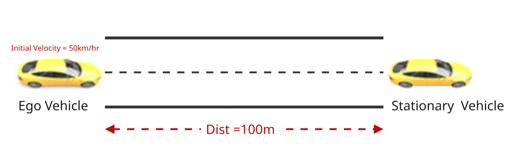
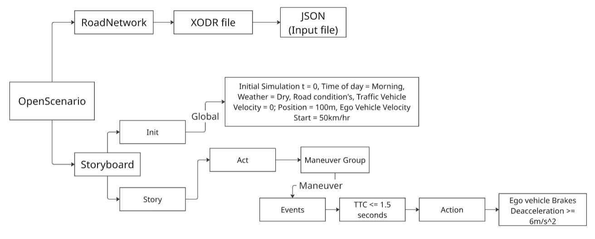

#*ASAM-Based Automated Scenario Generation for ADAS Feature*

#*AIM* - To build a complete python pipeline that converts a JSON defined concerete scenario parameter file into a structured ASAM OPENSCENARIO compliant XML file for scenario testing. 
The pipeline is built for the selected AEB feature as defined by EuroNCAP guidelines by considering the defined test metrics - showing the scenario based testing workflow. 

#*Objective* - 
1.Learning to parse,validate and structure a JSON data using python as a scenario input parameter.
2.To understand and apply ASAM OPENSCENARIO framework(Storyboard->story->Act ->Manuever->Event->Action) 
3.Implement a Basic Open-loop simmulation for AEB (Car-to-CAr Rear stationary) scenario with parameters. 
4.Build a lightweight kinematic simulator to execute the scenario and evaluate pas/fail criteria (TTC,Minimum gap,collision) 
5.Practice GIt based version control 

#*Tech Stack*
 -Python 3.10+
 -scenariogeneration — OpenSCENARIO/OpenDRIVE file generation
 -pydantic — JSON schema validation
 -esmini — open-source OpenSCENARIO player, used for execution and visualization

#*Project Structure* 
ASAM OpenSCENARIO Project/
├── src/
│   ├── Config.JSON                          # Scenario input parameters 
│   ├── main.py                              # Orchestrates the full pipeline
│   ├── parser.py                            # JSON loading + pydantic validation 
│   ├── build_road.py                        # Generates the .xodr file
│   ├── build_scenario.py                    # Generates the .xosc file 
│   └── run_esmini.py                        # Launches esmini on the generated .
├── outputs/
│   ├── aeb_ccrs_basic.xodr                  # Generated road network
│   └── aeb_ccrs_basic.xosc                  # Generated scenario file
├── image.png                                # ODD definition diagram
├── image-1.png                              # OpenSCENARIO storyboard structure 
├── esmini--oscaeb_ccrs_basic.xosc....gif    # Recorded esmini simulation run
├── requirements.txt
└── README.md

#*ADAS Scenario* 
To understand and generate the XML files for scenario based testing (SBT), an AEB feature is selected under the study. The ODD (Operational Design Domain) is defined for a Car-to-Car Rear Stationary (CCRs) scenario case for an AEB feature based on the test protocol guidelines established by EuroNCAP. 

The concerete scenario parameters are defined based on the ODD defenition in the CONFIG.JSON file. 

#*ASAM OpenSCENARIO FrameWork*

The standard follows a Storyboard structure which defines how the different entities interact with each other within the defined scenario. The image below highlights the layout of the structure follwed in the PEGASUS project. 

As, indicated in the diagram, the scenario XML file (XSOC) based on the openSCENARIO standard defines the dynamic behavior of the different entities which are linked with the static road network defined by XML file (XODR) using the openDRIVE standard. 

The SCENARIOGENERATION python module lets you design the XODR and XOSC files. The sub modules like storyboard,story,act,manuevers,events and actions help model the different interactions within the roadnetwork. 

The main.py module is where the files are loaded and functions are called, which links the different sub python files and finally the simulator. 

The parse.py file takes the JSON input file and validates the parameters by parsing. Initially the JSON file consists of a single concerete scenario (test case). However, a scenario generation script can be built using Bayseian optimizer or constraint randomization to automate the generation of multiple concerete scenarios(test cases) by sweping accross the design space from the logical scenario. 

The Build_Road.py and Build_Scenario.py files generate the XODR and XSOC files in XML format. The Build_Scenario.py follows the storyboard structure defined above.The output is stored in the OUTPUT folder of the project. 

The run.py files lets you execute the external open source low fidelity simulator for visualizing the openSCENARIO files in the XML format. 

#*Results* 

This validates that a given braking profile, if triggered at a given TTC, is kinematically sufficient to avoid collision under the specified speed and friction — it does not evaluate a perception or decision algorithm.
The following ouput shows the Ego and Traffic vehicle spawn at start of the simulation. And also presence of road profile, where ego vehicle starts at initial velocity of 50km/hr. The vehicle comes to a stop when the trigger condition (TTC<=1.5) gets initiated.

#*Future Scope* 
-The project can be further explored by increasing the complexity of scenario generation by spawning different traffic objects. 
-The project can further be explored to deploy test automation or batch generation of the scenarios along with implementing scenario generator algorithms. 

#*Acknowledgments / References*
-ASAM OpenSCENARIO and OpenDRIVE standards
-esmini — open-source OpenSCENARIO player
-scenariogeneration Python library
-Euro NCAP AEB Car-to-Car test protocol